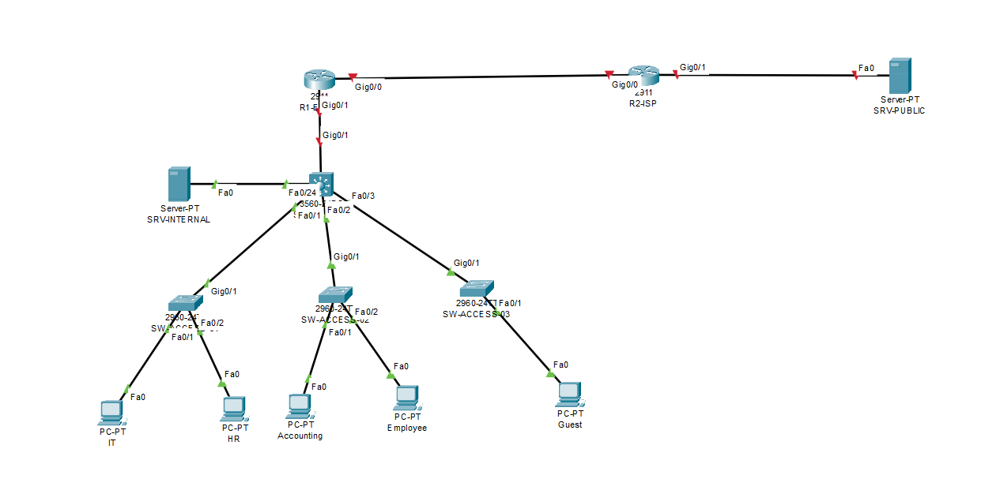

# Secure Segmented Enterprise Network in Cisco Packet Tracer

> Status: Planning and implementation in progress.

## Overview

This project designs and implements a secure, segmented network for a small enterprise using Cisco Packet Tracer. Business departments are separated with VLANs, routed through a multilayer core switch, provided centralized network services, and protected by access-control and device-hardening measures.

The repository documents the complete workflow from requirements and addressing design to device configuration, verification, troubleshooting, and final test evidence.

## Business Requirements

- Separate IT, Human Resources, Accounting, Employees, Servers, Guest, and Management traffic.
- Automatically assign client addressing through centralized DHCP.
- Provide internal DNS and web services.
- Simulate controlled Internet access through an ISP and NAT overload.
- Prevent Guest devices from reaching internal private networks.
- Isolate Human Resources and Accounting user networks.
- Allow SSH device administration only from the IT VLAN.
- Protect access ports and disable unused switch ports.

## Architecture

Topology image will be added after the initial Packet Tracer design is completed. The planned cabling and interface map are documented in [`docs/interface-map.md`](docs/interface-map.md).


## Device Inventory

| Quantity | Device | Role |
|---:|---|---|
| 1 | Cisco 2911 | Enterprise edge router and NAT gateway |
| 1 | Cisco 2911 | Simulated ISP router |
| 1 | Cisco 3560 multilayer switch | Core routing and VLAN gateways |
| 3 | Cisco 2960 switches | User access layer |
| 1 | Server-PT | DHCP, DNS, and internal HTTP services |
| 1 | Server-PT | Simulated public web server |
| 5 | PC-PT | Department and Guest test endpoints |

## VLAN and Addressing Plan

| VLAN | Name | Network | Gateway |
|---:|---|---|---|
| 10 | IT | 192.168.10.0/24 | 192.168.10.1 |
| 20 | HR | 192.168.20.0/24 | 192.168.20.1 |
| 30 | ACCOUNTING | 192.168.30.0/24 | 192.168.30.1 |
| 40 | EMPLOYEES | 192.168.40.0/24 | 192.168.40.1 |
| 50 | SERVERS | 192.168.50.0/24 | 192.168.50.1 |
| 60 | GUEST | 192.168.60.0/24 | 192.168.60.1 |
| 99 | MANAGEMENT | 192.168.99.0/24 | 192.168.99.1 |
| 999 | BLACKHOLE | Not routed | None |

## Technologies and Concepts

The following items must only be marked as completed after successful implementation and verification:

- [ ] VLANs and access ports
- [ ] IEEE 802.1Q trunking
- [ ] Inter-VLAN routing with SVIs
- [ ] Centralized DHCP and DHCP relay
- [ ] Internal DNS and HTTP services
- [ ] Static and default routing
- [ ] NAT overload/PAT
- [ ] Extended ACLs
- [ ] SSH management restriction
- [ ] Switch port security
- [ ] Unused-port shutdown and black-hole VLAN

## Security Policy

| Source | Destination | Policy |
|---|---|---|
| IT | Network management interfaces | Allow SSH |
| Non-IT user VLANs | Network management interfaces | Deny SSH |
| HR | Accounting user network | Deny |
| Accounting | HR user network | Deny |
| Guest | Internal private networks | Deny, except required DNS |
| Guest | Simulated public network | Allow |
| Business VLANs | Internal DNS and web services | Allow |

## Verification Summary

Test results will be published in [`docs/test-results.md`](docs/test-results.md) after each control is implemented.

## Repository Structure

```text
.
├── packet-tracer/        Packet Tracer project versions and final lab
├── configs/              Sanitized device running configurations
├── docs/                 Requirements, addressing, policies, and test results
├── diagrams/             Logical and physical topology images
├── screenshots/          Verification evidence
├── PROJECT_GUIDE_VI.md   Detailed Vietnamese implementation guide
└── README.md             Public project documentation
```

## How to Use

1. Install Cisco Packet Tracer.
2. Download the final `.pkt` file from `packet-tracer/` after it is published.
3. Open the file and allow device links to converge.
4. Follow the test cases in `docs/test-results.md`.
5. Review sanitized configurations under `configs/`.

## Challenges and Troubleshooting

This section will document real implementation problems, diagnostic commands, root causes, and fixes. It will not be filled with hypothetical issues.

## Limitations

- This project is a Cisco Packet Tracer simulation, not a production deployment.
- Packet Tracer supports only a subset of Cisco IOS features.
- High availability, dynamic routing, wireless infrastructure, firewall appliances, SIEM integration, and centralized AAA are outside the first release.

## Future Improvements

- Centralized NTP and Syslog.
- AAA-based device authentication.
- Firewall integration.
- Redundant core and gateway design.
- Wazuh SIEM monitoring in a separate virtualized lab.

## Author

**Chau Thai Khang**  
Information Technology student, HUFLIT  
GitHub: [Whitepuil](https://github.com/Whitepuil)
