# Secure Segmented Enterprise Network in Cisco Packet Tracer

> Status: Completed and fully verified.

## Overview

This project designs and implements a secure, segmented network for a small enterprise using Cisco Packet Tracer. Business departments are separated with VLANs, routed through a multilayer core switch, provided centralized network services, and protected by access-control and device-hardening measures.

The repository documents the complete workflow from requirements and addressing design to device configuration, verification, troubleshooting, and final test evidence.

## Business Requirements

- Separate IT, Human Resources, Accounting, Employees, Servers, Guest, and Management traffic.
- Automatically assign client addressing through centralized DHCP.
- Provide internal DNS and web services.
- Simulate controlled Internet access through an ISP and NAT overload.
- Prevent Guest devices from reaching internal private networks.
- Isolate Human Resources and Accounting user networks.
- Allow SSH device administration only from the IT VLAN.
- Protect access ports and disable unused switch ports.

## Architecture

The topology follows a hierarchical enterprise design with an access layer,
a multilayer core switch, an enterprise edge router, and a simulated ISP
network. The detailed cabling and interface assignments are documented in
[`docs/interface-map.md`](docs/interface-map.md).


## Device Inventory

| Quantity | Device | Role |
|---:|---|---|
| 1 | Cisco 2911 | Enterprise edge router and NAT gateway |
| 1 | Cisco 2911 | Simulated ISP router |
| 1 | Cisco 3560 multilayer switch | Core routing and VLAN gateways |
| 3 | Cisco 2960 switches | User access layer |
| 1 | Server-PT | DHCP, DNS, and internal HTTP services |
| 1 | Server-PT | Simulated public web server |
| 5 | PC-PT | Department and Guest test endpoints |

## VLAN and Addressing Plan

| VLAN | Name | Network | Gateway |
|---:|---|---|---|
| 10 | IT | 192.168.10.0/24 | 192.168.10.1 |
| 20 | HR | 192.168.20.0/24 | 192.168.20.1 |
| 30 | ACCOUNTING | 192.168.30.0/24 | 192.168.30.1 |
| 40 | EMPLOYEES | 192.168.40.0/24 | 192.168.40.1 |
| 50 | SERVERS | 192.168.50.0/24 | 192.168.50.1 |
| 60 | GUEST | 192.168.60.0/24 | 192.168.60.1 |
| 99 | MANAGEMENT | 192.168.99.0/24 | 192.168.99.1 |
| 999 | BLACKHOLE | Not routed | None |

## Technologies and Concepts

The following items must only be marked as completed after successful implementation and verification:

- [X] VLANs and access ports
- [X] IEEE 802.1Q trunking
- [X] Inter-VLAN routing with SVIs
- [X] Centralized DHCP and DHCP relay
- [X] Internal DNS and HTTP services
- [X] Static and default routing
- [X] NAT overload/PAT
- [X] Extended ACLs
- [X] SSH management restriction
- [X] Switch port security
- [X] Unused-port shutdown and black-hole VLAN

## Security Policy

| Source | Destination | Policy |
|---|---|---|
| IT | Network management interfaces | Allow SSH |
| Non-IT user VLANs | Network management interfaces | Deny SSH |
| HR | Accounting user network | Deny |
| Accounting | HR user network | Deny |
| Guest | Internal private networks | Deny, except required DNS |
| Guest | Simulated public network | Allow |
| Business VLANs | Internal DNS and web services | Allow |

## Verification Summary

All implementation and security controls were validated through 27 documented test cases in [`docs/test-results.md`](docs/test-results.md).
### Completed Layer 2 Verification

- VLANs 10, 20, 30, 40, 50, 60, 99, and 999 were created successfully.
- Access ports were assigned to their intended departmental VLANs.
- Three IEEE 802.1Q trunks are operational between the core and access switches.
- VLAN 999 is used as the native VLAN on trunk links.

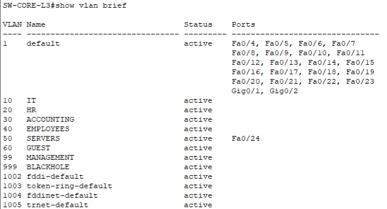

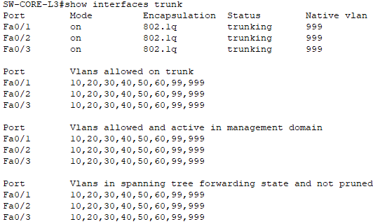

### Completed Layer 3 Verification

- Seven switched virtual interfaces were configured as departmental default gateways.
- IP routing was enabled on the multilayer core switch.
- The core switch learned all departmental networks as directly connected routes.
- Management VLAN connectivity was verified between the core and access switches.
- Inter-VLAN connectivity was successfully tested between the IT, HR, and Server VLANs.
- No access-control lists are applied at this stage, so inter-VLAN traffic is temporarily permitted for baseline verification.

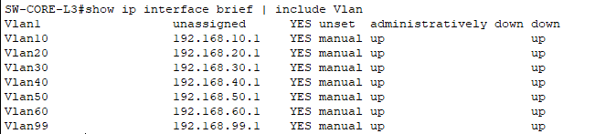

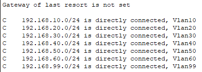

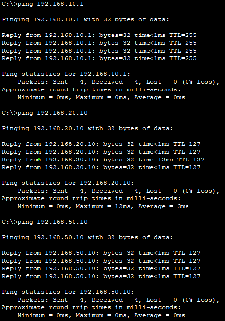

### Completed Network Services Verification

- A centralized DHCP server was deployed in VLAN 50 at `192.168.50.10`.
- Five DHCP pools were created for the IT, HR, Accounting, Employees, and Guest VLANs.
- DHCP relay was configured on the corresponding core switch SVIs.
- Clients in different VLANs successfully received the correct IPv4 address, subnet mask, default gateway, and DNS server.
- Internal DNS successfully resolved `intranet.company.local` to `192.168.50.10`.
- The internal HTTP portal was successfully accessed by hostname from a client VLAN.
- Guest access was temporarily permitted during baseline service verification and was later restricted by the access-control policies documented below.

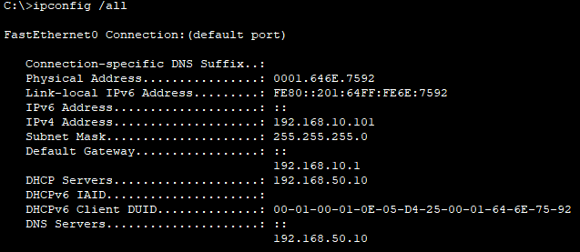

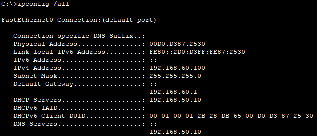

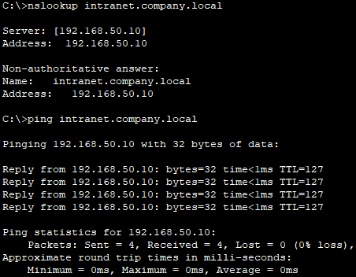

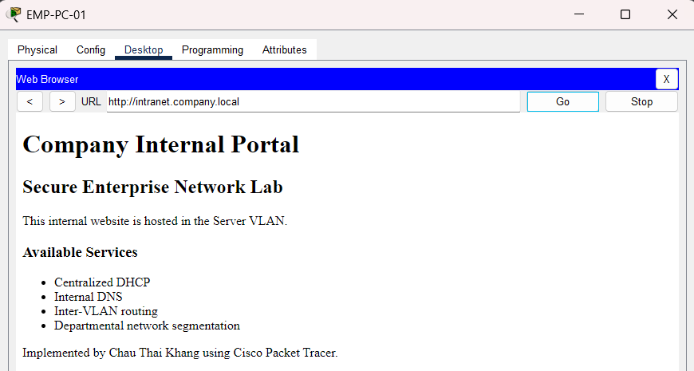

### Completed Edge and Internet Verification

- A routed `/30` transit link was configured between the multilayer core switch and the enterprise edge router.
- Static summary and default routes were configured to provide bidirectional internal routing and simulated ISP connectivity.
- NAT overload translated private departmental addresses to the edge router address `203.0.113.2`.
- Dynamic ICMP and TCP translations were observed for clients in the IT and Guest VLANs.
- Internal DNS resolved `public.example.test` to the simulated public server at `198.51.100.10`.
- The public web service was successfully accessed from both trusted and Guest client VLANs.
- A four-hop traceroute verified the forwarding path through the core switch, edge router, ISP router, and public server.

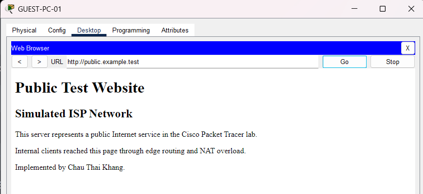

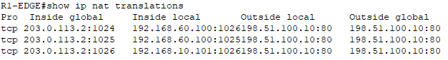

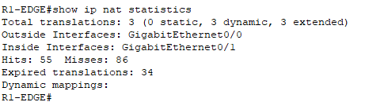

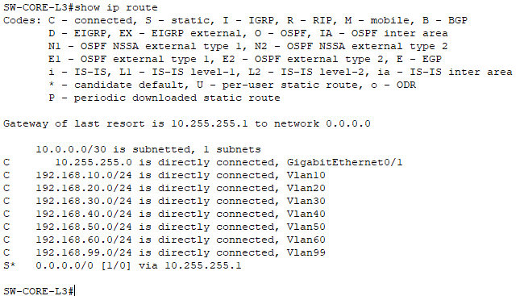

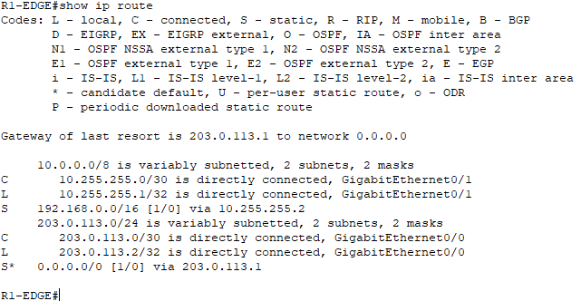

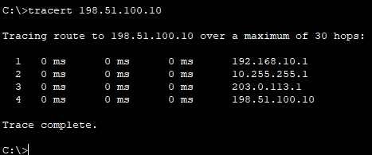

### Completed Access-Control Verification

- Extended inbound ACLs were applied close to the source on the Guest, HR, and Accounting SVIs.
- Guest clients are permitted to obtain DHCP leases and query the centralized DNS server.
- Guest traffic to RFC 1918 private networks is denied while simulated public-network access remains available.
- HR and Accounting user networks are mutually isolated.
- HR and Accounting clients retain access to approved internal services and the simulated public network.
- ACL match counters confirmed that permit and deny entries processed the expected test traffic.

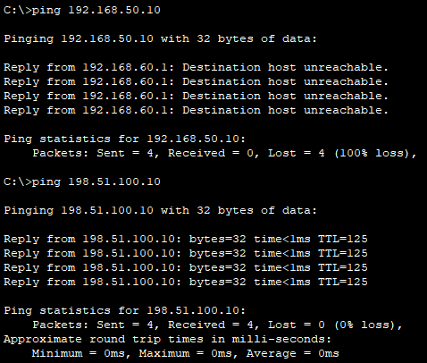

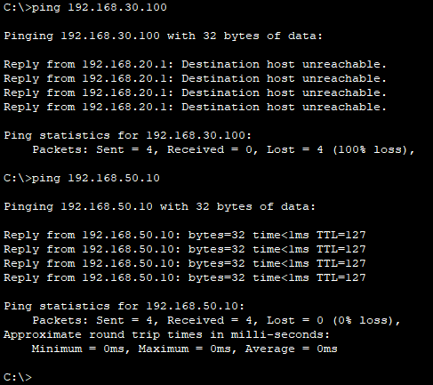

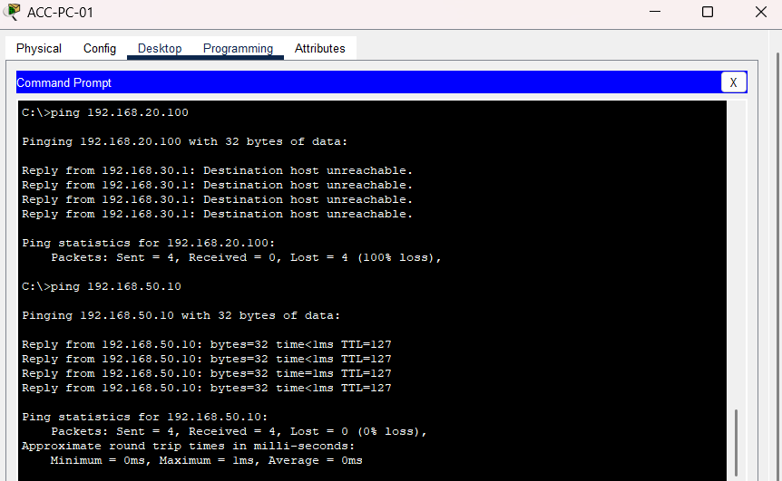

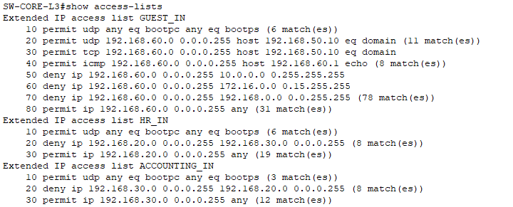

### Completed Secure Management Verification

- SSH version 2 was enabled on the enterprise core switch, access switches, and edge router.
- Local administrative authentication was configured for the Packet Tracer lab.
- A standard VTY access control list restricts remote device management to the IT VLAN.
- IT administrators successfully accessed enterprise network devices through SSH.
- SSH attempts originating from the HR VLAN were denied before authentication.
- Telnet access was disabled by allowing only SSH on the VTY lines.
- Permit and deny counters confirmed that the management ACL processed the expected traffic.

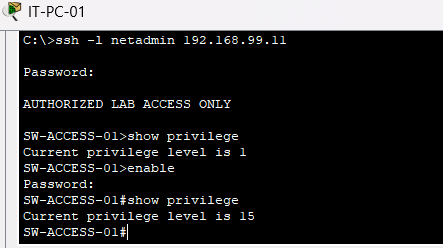

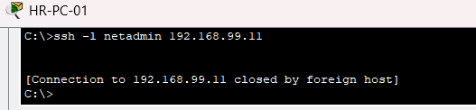

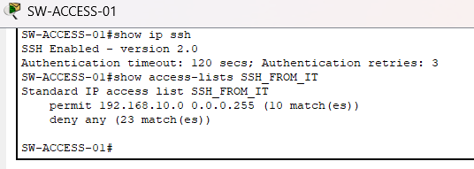

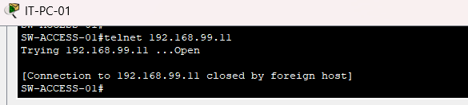

### Completed Access-Layer Hardening Verification

- Port Security was enabled on all user-facing access ports and the internal server port.
- Each protected port permits a maximum of one dynamically learned sticky MAC address.
- Restrict mode drops frames from unauthorized MAC addresses without disabling the entire port.
- An unauthorized test endpoint was blocked and increased the security violation counter.
- PortFast and BPDU Guard were enabled on endpoint-facing access ports.
- Unused access-switch and core-switch ports were assigned to VLAN 999 and administratively disabled.
- Trunk, routed, server, and legitimate user interfaces remained operational after hardening.

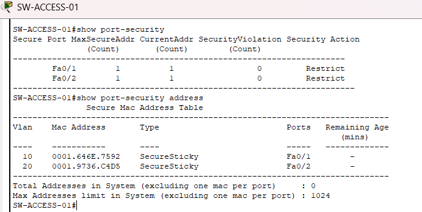

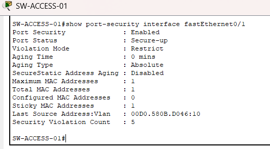

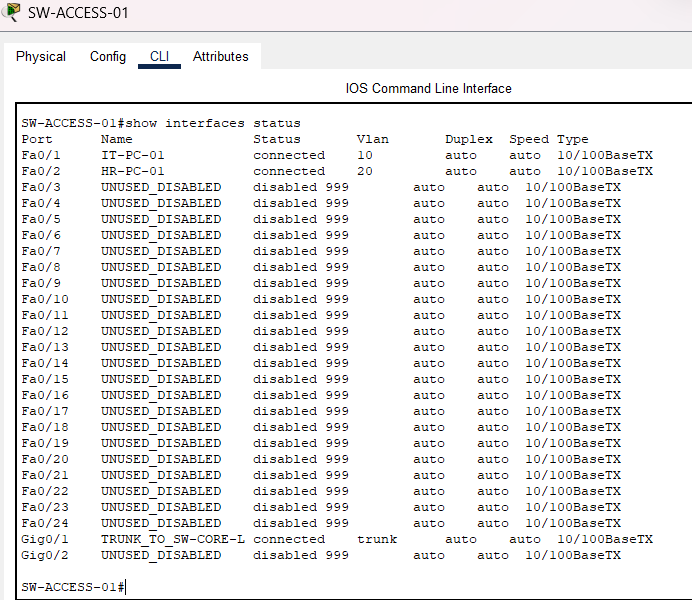

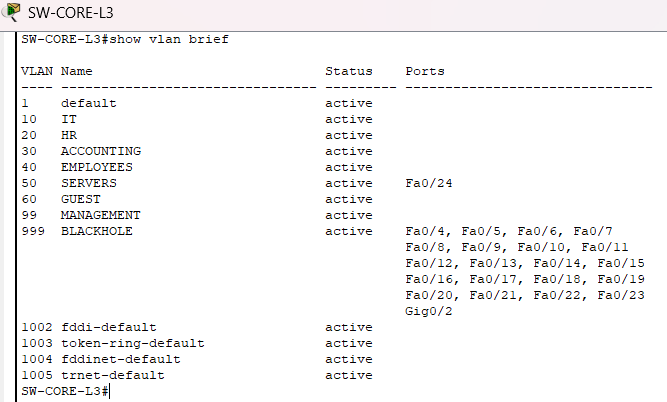

### Final Regression Verification

- The final Packet Tracer topology was saved, closed, and reopened successfully.
- Three core-to-access IEEE 802.1Q trunks remained operational with native VLAN 999.
- Seven routed SVIs and the core-to-edge routed interface remained up/up.
- DHCP, DNS, internal services, simulated Internet access, and NAT remained operational.
- Guest, HR, and Accounting access-control policies continued to enforce the intended segmentation.
- SSH management remained restricted to the IT VLAN.
- Port Security and unused-port hardening remained active after reopening the final file.

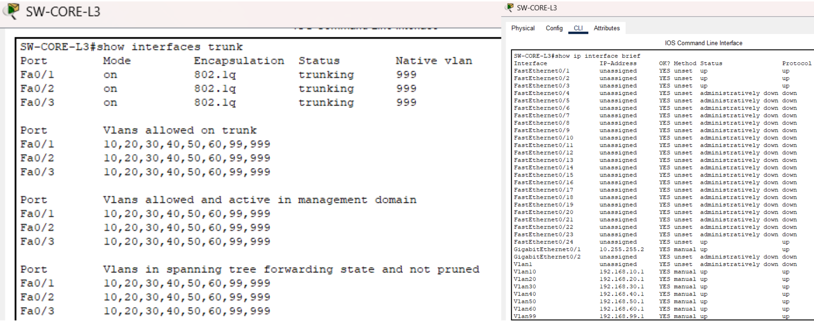

## Repository Structure

```text
.
├── packet-tracer/        Packet Tracer project versions and final lab
├── configs/              Sanitized device running configurations
├── docs/                 Requirements, addressing, policies, and test results
├── diagrams/             Logical and physical topology images
├── screenshots/          Verification evidence
├── PROJECT_GUIDE_VI.md   Detailed Vietnamese implementation guide
└── README.md             Public project documentation
```
## Skills Demonstrated

- Designed a hierarchical enterprise network with core, access, edge, and simulated ISP layers.
- Implemented departmental segmentation using VLANs and IEEE 802.1Q trunks.
- Configured inter-VLAN routing with multilayer-switch SVIs.
- Deployed centralized DHCP, DHCP relay, DNS, and internal HTTP services.
- Implemented static routing, default routing, and NAT overload.
- Enforced Guest, HR, and Accounting segmentation through extended ACLs.
- Restricted network-device management to SSH version 2 from the IT VLAN.
- Hardened endpoint-facing ports with Port Security, PortFast, and BPDU Guard.
- Disabled unused switch interfaces and assigned them to a black-hole VLAN.
- Created and executed 27 documented verification and security test cases.

## How to Use

1. Install Cisco Packet Tracer.
2. Download the final `.pkt` file from `packet-tracer/` after it is published.
3. Open the file and allow device links to converge.
4. Follow the test cases in `docs/test-results.md`.
5. Review sanitized configurations under `configs/`.

## Challenges and Troubleshooting

### Public hostname resolution failure

Clients could initially reach the simulated public server by IP address but could not resolve `public.example.test`. The DNS record had mistakenly been created on the public server instead of the centralized internal DNS server. The record was recreated on `SRV-INTERNAL`, after which DNS resolution and hostname-based HTTP access succeeded.

### ACL verification inconsistency

Packet Tracer did not always display the inbound ACL name correctly in `show ip interface vlan` output. ACL attachment was therefore verified through the running configuration, ACL match counters, and functional traffic tests. Guest-to-private, HR-to-Accounting, and Accounting-to-HR traffic was successfully denied.

### Port Security recovery

A temporary unauthorized endpoint triggered Port Security on an access port. Restrict mode dropped traffic from the unauthorized MAC address without disabling the port. After reconnecting the legitimate endpoint, normal connectivity was restored while the violation counter remained available as evidence.

### Initial packet loss after reopening

The first ping to the simulated public network experienced temporary packet loss while devices relearned ARP, MAC-address, and forwarding information. A repeated test completed with 0% packet loss, confirming normal operation after convergence.

## Limitations

- This project is a Cisco Packet Tracer simulation, not a production deployment.
- Packet Tracer supports only a subset of Cisco IOS features.
- High availability, dynamic routing, wireless infrastructure, firewall appliances, SIEM integration, and centralized AAA are outside the first release.

## Future Improvements

- Centralized NTP and Syslog.
- AAA-based device authentication.
- Firewall integration.
- Redundant core and gateway design.
- Wazuh SIEM monitoring in a separate virtualized lab.

## Author

**Chau Thai Khang**  
Information Technology student, HUFLIT  
GitHub: [Whitepuil](https://github.com/Whitepuil)
